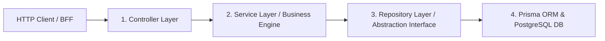

[](https://classroom.github.com/a/EdN1T4tj)

# ⚙️ TruBrush — Backend Core API Engine
> **REST API Server Berbasis NestJS, Prisma ORM, dan PostgreSQL untuk Ekosistem Seni Otentik Anti-AI & Escrow Marketplace**

---

## 🌟 1. Gambaran Umum (*Overview*)

**TruBrush Backend** adalah mesin API inti (*core server engine*) yang menangani seluruh proses bisnis kritis platform **TruBrush**. Arsitektur backend dibangun dengan standar perusahaan (*enterprise grade*) berbasis **NestJS**, **TypeScript**, dan **Prisma ORM**, menerapkan prinsip **SOLID, DRY, dan KISS**, pemisahan layer data terisolasi, serta kepatuhan *Role-Based Access Control (RBAC)*.

---

## 🏛️ 2. Pola Arsitektur & Prinsip Desain (*Architectural Patterns*)

Backend TruBrush mengimplementasikan pola aliran data 4-lapisan (*4-Tier Layered Architecture*):



### Prinsip Utama yang Diterapkan:
1. **Single Responsibility & Data Layer Isolation:**
   - `Controller`: Hanya menangani *routing*, serialisasi request/response, dan validasi DTO Swagger.
   - `Service`: Murni memproses aturan bisnis, validasi logika, dan formula matematika.
   - `Repository`: Mengenkapsulasi query database Prisma di balik antarmuka (*Interface*) kontrak.
2. **Auth Module Isolation:**
   - `AuthModule` memiliki `AuthRepository` independen dan tidak menginjeksi `UsersService` secara langsung guna menghindari dependensi sirkular.
3. **Role-Based Access Control (RBAC):**
   - Menggunakan dekorator kustom `@Roles(...)` dan penjaga otorisasi `RolesGuard` untuk membedakan hak akses 4 peran: `artist`, `client`, `curator`, dan `admin`.
4. **Middlewares Global:**
   - `HttpLoggerMiddleware`: Mencatat setiap *incoming request* beserta metode, endpoint, status code, dan waktu eksekusi.
   - `MaintenanceMiddleware`: Mengamankan platform saat mode pemeliharaan aktif.

---

## 🚀 3. Modul & Spesifikasi REST API (*Core Modules*)

| Modul Backend | Tanggung Jawab & Fitur Bisnis Utama |
|---|---|
| **`AuthModule`** | Registrasi pengguna (Bcrypt hash), login JWT, rotasi refresh token via HttpOnly Cookie, dan proteksi sesi. |
| **`UsersModule`** | Manajemen akun pengguna, profil seniman/klien, pemutakhiran data, dan sistem sanksi *strike penalty*. |
| **`ArtworksModule`** | Manajemen portofolio seni, alur kurasi WIP anti-AI, relasi multi-tag, dan sistem takedown/restore karya. |
| **`CommissionsModule`** | Siklus komisi seni, transaksi pembayaran escrow aman, pelacak sketsa/milestone, dan potongan fee platform 5%. |
| **`DisputesModule`** | Pengajuan sengketa komisi dan mediasi admin (klaim refund dana escrow ke klien & penalti strike artis). |
| **`ReportsModule`** | Sistem aduan karya bermasalah, penindakan pelanggaran oleh kurator, dan auto-hide feed publik. |
| **`AppealsModule`** | Permohonan banding seniman atas pembekuan akun (*strike $\ge 3$*), peninjauan admin, dan auto-reset strike. |
| **`TransactionsModule`** | Buku kas transaksi platform (`WalletTransaction`), agregasi GMV, saldo escrow, mutasi top up & penarikan dana. |
| **`CuratorPerformanceModule`** | Evaluasi analitik performa kurasi, perhitungan rata-rata durasi SLA respons kurator, rasio kelolosan anti-AI, dan ekspor CSV. |
| **`AuditLogsModule`** | Agregasi kronologis seluruh rekam jejak keputusan moderasi (kurasi, laporan, sengketa, dan banding). |
| **`TagsModule`** | Manajemen master tag global (CRUD tag dengan relasi transaksional aman). |
| **`UploadModule`** | Unggah berkas media aman (karya, bukti WIP sketsa, dan deliverable komisi). |

---

## 🧮 4. Rumus Logika Bisnis & Perhitungan Inti (*Core Formulas*)

### 1. Pembagian Dana Escrow & Fee Platform (5%)
$$\text{Platform Fee} = \text{Commission Price} \times 0.05$$
$$\text{Artist Net Payout} = \text{Commission Price} \times 0.95$$

### 2. SLA Kecepatan Respons Kurator
$$\text{SLA Minutes} = \frac{\text{ReviewedAt} - \text{CreatedAt}}{1000 \times 60}$$

### 3. Rasio Kelolosan Anti-AI (*Approval Rate*)
$$\text{Approval Rate} = \left(\frac{\text{Approved Artworks}}{\text{Total Reviewed Artworks}}\right) \times 100\%$$

---

## 🛠️ 5. Tumpukan Teknologi (*Tech Stack*)

| Lapisan / Kategori | Teknologi yang Digunakan |
|---|---|
| **Framework Server** | [NestJS 11](https://nestjs.com/) (Node.js REST API Framework) |
| **Bahasa Pemrograman** | [TypeScript](https://www.typescriptlang.org/) |
| **Database & ORM** | [PostgreSQL (Supabase)](https://supabase.com/), [Prisma ORM](https://www.prisma.io/) |
| **Otentikasi & Keamanan** | [Passport JWT](http://www.passportjs.org/), [Bcrypt](https://github.com/kelektiv/node.bcrypt.js) |
| **Validasi & Dokumentasi** | [class-validator](https://github.com/typestack/class-validator), [Swagger OpenAPI](https://swagger.io/) |
| **Unit Testing** | [Jest](https://jestjs.io/) |
| **Linter & Formatter** | [Biome](https://biomejs.dev/) |
| **Package Manager** | [Pnpm](https://pnpm.io/) |

---

## 📂 6. Struktur Direktori Proyek

```
crack-be-diba15/
├── docs/                               # Dokumentasi Teknis & Bisnis
│   ├── BUSINESS_PROCESS.md             # Alur Proses Bisnis End-to-End
│   └── LOGIC_DOCS.md                   # Logika Bisnis & Formula Perhitungan
├── prisma/
│   ├── schema.prisma                   # Skema Model Database Prisma
│   └── seed.ts                         # Data Awal / Seeding Database (2026 Timestamps)
├── src/
│   ├── common/                         # Antarmuka, Guards, Interceptors, & Middlewares
│   │   ├── guards/                     # RolesGuard, JwtAuthGuard
│   │   ├── interfaces/                 # Repository Interfaces Kontrak (DIP)
│   │   └── middlewares/                # HttpLoggerMiddleware, MaintenanceMiddleware
│   ├── auth/                           # Modul Otentikasi & AuthRepository
│   ├── artworks/                       # Modul Karya Seni, Kurasi, & Tags
│   ├── commissions/                    # Modul Pesanan Komisi & Escrow
│   ├── disputes/                       # Modul Sengketa & Refund Escrow
│   ├── reports/                        # Modul Laporan & Moderasi
│   ├── appeals/                        # Modul Banding Akun Seniman
│   ├── transactions/                   # Modul Laporan Finansial & Wallet Transaction
│   ├── curator-performance/            # Modul Evaluasi SLA & Kinerja Kurator
│   ├── audit-logs/                     # Modul Log Audit Kronologis
│   ├── app.module.ts                   # Modul Utama Aplikasi
│   └── main.ts                         # Entry Point Server & Swagger Setup
├── biome.json                          # Konfigurasi Linter Biome
├── package.json                        # Dependencies & Script Eksekusi
└── tsconfig.json                       # Konfigurasi TypeScript
```

---

## ⚙️ 7. Panduan Instalasi & Menjalankan Backend (*Getting Started*)

### 1. Prasyarat (*Prerequisites*)
Pastikan telah menginstal [Pnpm](https://pnpm.io/) pada sistem Anda:
```bash
pnpm --version
```

### 2. Instalasi Dependensi
```bash
pnpm install
```

### 3. Konfigurasi Environment Variables (`.env`)
Buat berkas `.env` pada *root directory* backend:
```env
DATABASE_URL="postgresql://postgres:[PASSWORD]@[HOST]:[PORT]/postgres?schema=public"
DIRECT_URL="postgresql://postgres:[PASSWORD]@[HOST]:[PORT]/postgres?schema=public"
JWT_ACCESS_SECRET="your-access-secret-key"
JWT_REFRESH_SECRET="your-refresh-secret-key"
PORT=3001
NODE_ENV=development
```

### 4. Migrasi & Seeding Database
```bash
# Sinkronkan skema Prisma ke database
pnpm prisma migrate dev

# Jalankan data awal / mock data seeding
pnpm prisma db seed
```

### 5. Menjalankan Server Development
```bash
pnpm run start:dev
```
Server akan berjalan pada port `3001`.
- **Dokumentasi Interaktif Swagger OpenAPI:** [http://localhost:3001/docs](http://localhost:3001/docs)

---

## 🧪 8. Pengujian Unit & Jaminan Kualitas (*Quality Gates*)

Backend TruBrush memiliki cakupan pengujian unit ketat untuk setiap *Service* dan *Controller*:

```bash
# 1. Pengecekan Linting & Formatting dengan Biome (0 Error)
pnpm biome check

# 2. Menjalankan Seluruh Unit Test (100% Lulus: 25 Test Suites, 173 Tests)
pnpm test

# 3. Kompilasi Produksi NestJS (Exit Code 0)
pnpm run build
```

---

## 📖 9. Referensi Dokumentasi Tambahan

- 📄 [**Alur Bisnis & Matriks RBAC (BUSINESS_PROCESS.md)**](file:///d:/Revou/Assignment/crack_project/crack-be-diba15/docs/BUSINESS_PROCESS.md)
- 📐 [**Dokumentasi Logika & Formula Bisnis (LOGIC_DOCS.md)**](file:///d:/Revou/Assignment/crack_project/crack-be-diba15/docs/LOGIC_DOCS.md)