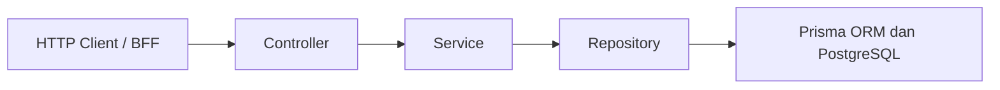

# TruBrush Backend

REST API untuk platform TruBrush, yaitu portofolio seni digital dan pemesanan komisi berbasis escrow yang hanya menerima karya buatan manusia. Backend ini menangani autentikasi, kurasi karya, siklus komisi dan pembayaran escrow, sengketa, laporan, banding akun, serta pencatatan transaksi.

Dibangun dengan NestJS, TypeScript, dan Prisma ORM di atas PostgreSQL. Akses dibatasi berdasarkan role (`artist`, `client`, `curator`, `admin`).

## Demo

| Layanan             | URL                                                 |
| ------------------- | --------------------------------------------------- |
| Backend (API)       | https://trubrush-be.up.railway.app/                 |
| Frontend            | https://trubrush.vercel.app                         |
| Repositori backend  | https://github.com/Revou-FSSE-Feb26/crack-be-Diba15 |
| Repositori frontend | https://github.com/Revou-FSSE-Feb26/crack-fe-Diba15 |

## Daftar Isi

- [Demo](#demo)
- [Arsitektur](#arsitektur)
- [Modul](#modul)
- [Aturan Bisnis](#aturan-bisnis)
- [Tech Stack](#tech-stack)
- [Struktur Direktori](#struktur-direktori)
- [Instalasi](#instalasi)
- [Skrip yang Tersedia](#skrip-yang-tersedia)
- [Dokumentasi Tambahan](#dokumentasi-tambahan)

## Arsitektur

Backend memakai arsitektur berlapis. Setiap request melewati empat lapisan:



| Lapisan    | Tugas                                                                               |
| ---------- | ----------------------------------------------------------------------------------- |
| Controller | Routing, serialisasi request dan response, serta validasi DTO (dokumentasi Swagger) |
| Service    | Aturan bisnis, validasi logika, dan perhitungan                                     |
| Repository | Query Prisma dan akses data                                                         |

Beberapa keputusan desain:

- **Modul auth mandiri.** `AuthModule` punya `AuthRepository` sendiri dan tidak menginjeksi `UsersService`, untuk menghindari dependensi sirkular.
- **Kontrol akses berbasis role.** Dekorator `@Roles(...)` dan `RolesGuard` membatasi endpoint per role.
- **Middleware global.** `HttpLoggerMiddleware` mencatat metode, endpoint, status code, dan durasi tiap request. `MaintenanceMiddleware` menutup akses saat mode pemeliharaan aktif.

## Modul

| Modul                      | Tanggung jawab                                                                                         |
| -------------------------- | ------------------------------------------------------------------------------------------------------ |
| `AuthModule`               | Registrasi (password di-hash dengan Bcrypt), login JWT, rotasi refresh token lewat HttpOnly cookie     |
| `UsersModule`              | Akun dan profil pengguna, serta sistem strike untuk seniman                                            |
| `ArtworksModule`           | Portofolio karya, alur kurasi bukti proses, relasi tag, dan takedown atau restore karya                |
| `CommissionsModule`        | Siklus komisi, pembayaran escrow, pelacakan sketsa dan milestone, serta fee platform 5%                |
| `DisputesModule`           | Pengajuan sengketa komisi dan mediasi admin (refund escrow ke klien dan strike untuk seniman)          |
| `ReportsModule`            | Laporan karya bermasalah, penindakan oleh kurator, dan penyembunyian otomatis karya dari feed publik   |
| `AppealsModule`            | Banding seniman atas pembekuan akun (strike 3 atau lebih), peninjauan admin, dan reset strike otomatis |
| `TransactionsModule`       | Buku kas (`WalletTransaction`), agregasi GMV dan saldo escrow, serta mutasi top up dan penarikan       |
| `CuratorPerformanceModule` | Analitik kinerja kurator: rata-rata SLA respons, rasio kelolosan verifikasi, dan ekspor CSV            |
| `AuditLogsModule`          | Riwayat kronologis keputusan moderasi (kurasi, laporan, sengketa, dan banding)                         |
| `TagsModule`               | CRUD tag global                                                                                        |
| `UploadModule`             | Unggah berkas media (karya, bukti proses, dan hasil akhir komisi)                                      |

Daftar endpoint lengkap ada di [docs/API-REFERENCES.md](docs/API-REFERENCES.md).

## Aturan Bisnis

Perhitungan inti yang dipakai backend:

- **Pembagian dana komisi.** Fee platform = harga komisi × 0,05. Pendapatan bersih seniman = harga komisi × 0,95.
- **SLA respons kurator (menit).** Selisih `reviewedAt` dan `createdAt` (milidetik) dibagi 60.000.
- **Rasio kelolosan.** Karya disetujui ÷ total karya yang direview × 100%.

Penjelasan lebih rinci ada di [docs/LOGIC_DOCS.md](docs/LOGIC_DOCS.md).

## Tech Stack

| Kategori             | Teknologi                                                                                                                                          |
| -------------------- | -------------------------------------------------------------------------------------------------------------------------------------------------- |
| Framework            | [NestJS 11](https://nestjs.com/)                                                                                                                   |
| Bahasa               | [TypeScript](https://www.typescriptlang.org/)                                                                                                      |
| Database dan ORM     | [PostgreSQL (Supabase)](https://supabase.com/), [Prisma ORM](https://www.prisma.io/)                                                               |
| Autentikasi          | [Passport JWT](http://www.passportjs.org/), [Bcrypt](https://github.com/kelektiv/node.bcrypt.js)                                                   |
| Validasi dan dokumen | [class-validator](https://github.com/typestack/class-validator), [Swagger (OpenAPI)](https://swagger.io/), [Scalar (OpenAPI)](https://scalar.com/) |
| Pengujian            | [Jest](https://jestjs.io/)                                                                                                                         |
| Linter dan formatter | [Biome](https://biomejs.dev/)                                                                                                                      |
| Package manager      | [pnpm](https://pnpm.io/)                                                                                                                           |

## Struktur Direktori

```
crack-be-Diba15/
├── docs/                   # Dokumentasi teknis dan bisnis
│   ├── postman/            # Koleksi Postman
│   ├── API-REFERENCES.md
│   ├── BUSINESS_PROCESS.md
│   ├── ERD.md
│   ├── LOGIC_DOCS.md
│   ├── REPORT_YAGNI.md
│   └── TEST_SCENARIO.md
├── prisma/
│   ├── schema.prisma       # Skema database
│   └── seed.ts             # Data awal
├── src/
│   ├── common/             # Guard dan middleware bersama
│   │   ├── guards/         # RolesGuard, JwtAuthGuard
│   │   └── middlewares/    # HttpLoggerMiddleware, MaintenanceMiddleware
│   ├── auth/               # Autentikasi dan AuthRepository
│   ├── artworks/           # Karya, kurasi, dan tag
│   ├── commissions/        # Komisi dan escrow
│   ├── disputes/           # Sengketa dan refund
│   ├── reports/            # Laporan dan moderasi
│   ├── appeals/            # Banding akun seniman
│   ├── transactions/       # Laporan finansial dan wallet transaction
│   ├── curator-performance/ # Kinerja dan SLA kurator
│   ├── audit-logs/         # Log audit
│   ├── health/             # Health check
│   ├── app.module.ts       # Modul utama
│   └── main.ts             # Entry point dan setup Swagger
├── biome.json
├── package.json
└── tsconfig.json
```

## Instalasi

### Prasyarat

- [pnpm](https://pnpm.io/). Cek dengan `pnpm --version`.
- Database PostgreSQL. Proyek ini memakai Supabase.

### Langkah

1. Pasang dependensi:

   ```bash
   pnpm install
   ```

2. Buat berkas `.env` di root proyek:

   ```env
   DATABASE_URL="postgresql://postgres:[PASSWORD]@[HOST]:[PORT]/postgres?schema=public"
   DIRECT_URL="postgresql://postgres:[PASSWORD]@[HOST]:[PORT]/postgres?schema=public"
   JWT_ACCESS_SECRET="your-access-secret-key"
   JWT_REFRESH_SECRET="your-refresh-secret-key"
   PORT=3001
   NODE_ENV=development
   ```

   Ganti nilai `[PASSWORD]`, `[HOST]`, dan `[PORT]` dengan kredensial database, dan isi kedua secret JWT dengan string acak.

3. Jalankan migrasi dan seed database:

   ```bash
   pnpm prisma migrate dev
   pnpm prisma db seed
   ```

4. Jalankan server development:

   ```bash
   pnpm run start:dev
   ```

   Server berjalan di <http://localhost:3001>. Dokumentasi Swagger tersedia di <http://localhost:3001/docs>.

## Skrip yang Tersedia

| Perintah             | Fungsi                                              |
| -------------------- | --------------------------------------------------- |
| `pnpm run start:dev` | Menjalankan server development                      |
| `pnpm run build`     | Membuat build produksi                              |
| `pnpm test`          | Menjalankan seluruh unit test dengan Jest           |
| `pnpm biome check`   | Menjalankan lint dan pengecekan format dengan Biome |

Sebelum commit, pastikan `pnpm biome check`, `pnpm test`, dan `pnpm run build` selesai tanpa error.

## Dokumentasi Tambahan

- [Referensi endpoint REST API](docs/API-REFERENCES.md)
- [Proses bisnis dan matriks RBAC](docs/BUSINESS_PROCESS.md)
- [Logika bisnis dan rumus perhitungan](docs/LOGIC_DOCS.md)
- [Laporan audit YAGNI](docs/REPORT_YAGNI.md)
- [Skenario pengujian manual](docs/TEST_SCENARIO.md)
- [Panduan dan koleksi Postman](docs/postman/README.md)
- [ERD](docs/ERD.md)
