# ERD TruBrush

Diagram di bawah dibuat dari `schema.prisma`. Nama kolom mengikuti nama di database (`@map`), dan tipe enum ditulis dengan nama enumnya.

```mermaid
erDiagram
    USER ||--o| PROFILE : "punya"
    USER ||--o{ SESSION : "login"
    USER ||--o{ ARTWORK : "mengunggah"
    USER |o--o{ ARTWORK : "mereview"
    USER ||--o{ COMMISSION : "memesan (client)"
    USER ||--o{ COMMISSION : "mengerjakan (artist)"
    USER ||--o{ REVISION : "menulis"
    USER |o--o{ DISPUTE_LOG : "memediasi"
    USER ||--o{ REPORT : "melaporkan"
    USER |o--o{ REPORT : "menangani (curator)"
    USER ||--o{ FAVORITE : "menyimpan"
    USER ||--o{ FOLLOW : "mengikuti (follower)"
    USER ||--o{ FOLLOW : "diikuti (artist)"
    USER ||--o{ PASSWORD_RESET_TOKEN : "meminta"
    USER ||--o{ WALLET_TRANSACTION : "memiliki"
    USER ||--o{ APPEAL : "mengajukan (artist)"
    USER |o--o{ APPEAL : "memutuskan (admin)"

    ARTWORK ||--o{ ARTWORK_TAG : "diberi"
    TAG ||--o{ ARTWORK_TAG : "dipakai"
    ARTWORK ||--o{ FAVORITE : "difavoritkan"
    ARTWORK |o--o{ REPORT : "dilaporkan"

    COMMISSION ||--o| COMMISSION_PROGRESS : "punya"
    COMMISSION ||--o{ REVISION : "memiliki"
    COMMISSION ||--o| DISPUTE_LOG : "bisa disengketakan"
    COMMISSION |o--o{ WALLET_TRANSACTION : "tercatat di"

    USER {
        string id PK
        string name
        string email UK
        string password
        Role role
        float balance
        datetime created_at
        datetime updated_at
    }

    PROFILE {
        string id PK
        string user_id FK, UK
        string avatar_url
        string bio
        string instagram_url
        string twitter_url
        string pixiv_url
        string website_url
        boolean is_verified
        int approved_portfolio_count
        boolean is_open_for_commission
        int base_price_idr
        int strike_count
        datetime updated_at
    }

    SESSION {
        string id PK
        string user_id FK
        string refresh_token
        string user_agent
        datetime created_at
        datetime updated_at
    }

    PASSWORD_RESET_TOKEN {
        string id PK
        string user_id FK
        string token UK
        datetime expires_at
        datetime created_at
    }

    ARTWORK {
        string id PK
        string artists_id FK
        string title
        string description
        string[] images_url
        string wip_proof_url
        UploadType upload_type
        CurationStatus curation_status
        boolean is_visible_on_feed
        string rejection_reason
        string reviewed_by FK
        datetime reviewed_at
        datetime created_at
    }

    TAG {
        string id PK
        string tag_name UK
    }

    ARTWORK_TAG {
        string artwork_id PK, FK
        string tag_id PK, FK
    }

    FAVORITE {
        string id PK
        string user_id FK
        string artwork_id FK
        datetime created_at
    }

    FOLLOW {
        string id PK
        string follower_id FK
        string artist_id FK
        datetime created_at
    }

    COMMISSION {
        string id PK
        string artists_id FK
        string client_id FK
        string commission_title
        string description
        int price
        CommissionStatus status
        PaymentStatus payment_status
        PaymentMethod payment_method
        string card_last_four
        datetime created_at
        datetime updated_at
    }

    COMMISSION_PROGRESS {
        string id PK
        string commission_id FK, UK
        string sketch_url
        boolean sketch_approved
        string final_artwork_url
        boolean final_artwork_approved
        string final_file_url
        datetime updated_at
    }

    REVISION {
        string id PK
        string commission_id FK
        string user_id FK
        string comment
        datetime created_at
    }

    DISPUTE_LOG {
        string id PK
        string commission_id FK, UK
        string reason
        DisputeStatus status
        string mediator_id FK
        datetime created_at
    }

    REPORT {
        string id PK
        string reporter_id FK
        ReportTargetType target_type
        string target_id
        string reason
        ReportStatus status
        string curator_id FK
        string artwork_id FK
        datetime created_at
    }

    WALLET_TRANSACTION {
        string id PK
        string user_id FK
        TransactionType type
        float amount
        string title
        TransactionStatus status
        string commission_id FK
        json metadata
        datetime created_at
    }

    APPEAL {
        string id PK
        string artist_id FK
        string reason
        AppealStatus status
        string resolved_by_id FK
        string resolution_notes
        datetime created_at
        datetime updated_at
    }
```

## Penjelasan Singkat

Tabel dikelompokkan berdasarkan fungsinya:

| Kelompok              | Tabel                                                    | Fungsi                                                                                                                                                               |
| --------------------- | -------------------------------------------------------- | -------------------------------------------------------------------------------------------------------------------------------------------------------------------- |
| Pengguna              | `users`, `profiles`, `sessions`, `password_reset_tokens` | Akun dengan empat role (`artist`, `client`, `admin`, `curator`), profil publik dan status verifikasi seniman, sesi login (refresh token), serta token reset password |
| Karya                 | `artworks`, `tags`, `artwork_tags`                       | Karya yang diunggah seniman beserta bukti proses (`wip_proof_url`) dan status kurasinya. Tag dan karya berelasi many-to-many lewat `artwork_tags`                    |
| Komisi                | `commissions`, `commission_progress`, `revisions`        | Pesanan komisi antara client dan artist, progres sketsa sampai hasil akhir, dan riwayat permintaan revisi                                                            |
| Sengketa dan moderasi | `dispute_logs`, `reports`, `appeals`                     | Sengketa komisi yang dimediasi admin, laporan terhadap karya atau profil yang ditangani kurator, dan banding akun seniman yang diputuskan admin                      |
| Keuangan              | `wallet_transactions`                                    | Buku kas saldo pengguna: top up, penarikan, pembayaran, pelepasan dana escrow, refund, dan fee platform                                                              |
| Sosial                | `favorites`, `follows`                                   | Karya yang difavoritkan dan seniman yang diikuti                                                                                                                     |

Alur utamanya: seniman mengunggah `artwork`, kurator mereview, lalu karya yang disetujui tampil di feed. Client membuat `commission` ke seorang artist. Pembayarannya tercatat di `wallet_transactions` dan progresnya di `commission_progress`. Jika terjadi masalah, client bisa membuka `dispute_log` untuk dimediasi admin.

## Catatan

- `REPORT.target_id` bersifat polimorfik (menunjuk ke artwork atau profil, tergantung `target_type`), jadi tidak ada foreign key untuknya. Relasi ke `ARTWORK` hanya lewat `artwork_id`.
- `USER` punya beberapa relasi ke tabel yang sama dengan peran berbeda: `COMMISSION` (client dan artist), `FOLLOW` (follower dan artist), `ARTWORK` (pengunggah dan reviewer), `REPORT` (pelapor dan kurator), `APPEAL` (pengaju dan admin).
